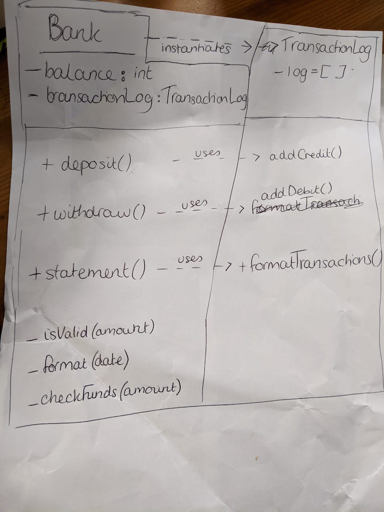

## Bank Tech Test

### User stories / requirements

* client can make a deposit of a numeric value (nb. from the specification, this will be an integer)
* client can make a withdrawal of a numeric value (nb. from the specification, this will be an integer)
* client can view/print account statement 
  * account statement displays date the transaction was made, a value in the credit (if deposit) or debit (if withdrawal) column, and the balance after the transaction
  * numbers on statement display with 2 decimal points 
  * account statement displays in the specified format as below:
```
date || credit || debit || balance
14/01/2023 || || 500.00 || 2500.00
13/01/2023 || 2000.00 || || 3000.00
10/01/2023 || 1000.00 || || 1000.00
```
### My approach to structuring the code: 
* Bank class is responsible for the user interface i.e. handles deposit, withdraw and prints statement
* TransactionLog class is responsible for recording the raw data of individual transactions and producing the transaction log 

### How to run the Bank code via node
1. Install dependencies by running npm install
2. Open node, or your chosen REPL
3. change directory into src
4. Load the file
``` > .load bank.js ```
4. Instantiate a Bank and make deposits, withdrawals, and request a printed to screen statement as per the example below.
  * You can only deposit and withdraw positive whole numbers, otherwise the client will receive an error message.
  * It is not necessary to pass a date. If you do not pass a specific date, the program will assume today's date.

#### Example of using the program with valid amounts:
``` 
> b = new Bank
Bank { balance: 0, transactionLog: TransactionLog { log: [] } }
> b.deposit(1000)
1000
1000
'You have made a deposit of £1000.00. Your balance is now 1000.00'
> b.deposit(2000, new Date(2022, 1, 23, 0, 0, 0, 0)
... )
2000
3000
'You have made a deposit of £2000.00. Your balance is now 3000.00'
> b.withdraw(2000, new Date(2022, 1, 24, 0, 0, 0, 0)
... )
'You have made a withdrawal of £2000.00. Your balance is now 1000.00'
> b.statement()
date || credit || debit || balance
24/02/2022 || || 2000.00 || 1000.00
23/02/2022 || 2000.00 || || 3000.00
22/02/2022 || 1000.00 || || 1000.00
```
#### Examples of errors when trying to withdraw an amount larger than your balance, or when trying to deposit an invalid amount: 
```
> b = new Bank
Bank { balance: 0, transactionLog: TransactionLog { log: [] } }
> b.withdraw(1)
Uncaught 'Insufficient funds!'
> b.deposit(-500)
Uncaught 'That is not a valid amount. Please enter a positive integer.'
 ```


### How to run the tests (jest) and linters (esLint): 
Install all dependencies within the project directory, per the dependencies in the package.json: 
```
npm install;
```

**To run the feature test:**
1. Open node, or your chosen REPL
2. Load the file and run the following command
``` > .load bank.js ```
3. Run the commands as per the feature_test.js file to check the return values and outputs.

**To run all unit tests or a particular test:** 

``` 
jest
jest bank.test.js
jest transaction_log.test.js
```
Test coverage is 100%. To check coverage, run: 
``` 
jest --coverage
```
**To run the linter:** 
```
npx eslint bank.js

```

#### Attempt at a UML diagram
<br>

